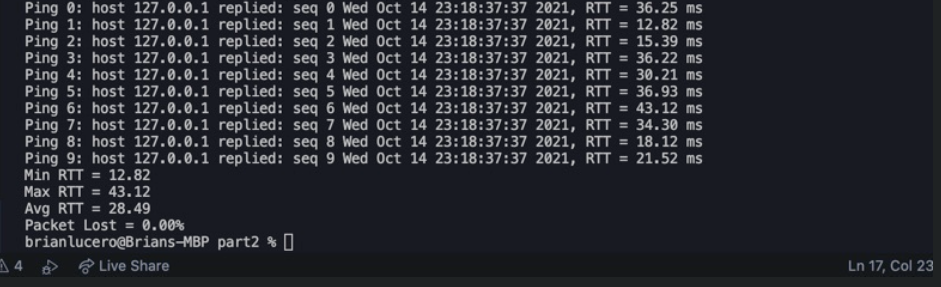

# UDP-Pinger

## Part 1 – UDP Pinger with No Delay and No Loss

* [X] Part 1:  `COMPLETE`

This project utilizes a UDP pinger, a tool designed to send a UDP packet to a target on an unallocated port and waits for a specific error answer. The most basic and correct way to retrieve data is targeting as many devices on the target network as we can.The Python Socket library has very straightforward functions in order to set up a socket, which acts as an endpoint in 2 way communication over a network: the socket() function returns a socket object whose methods implement the various socket system calls. So, basically:

**UDP sender:** Send the host name and system time as a message to a destination host designated by its IP address and port number. Repeat the transmission when enabled to do so.Read and display the returned messages, and indicate the IP address and port number of the sender. Also, will keep track of the RTT values of each ping and give a stats summary at the end, also indicating if there’s packet loss.

**UDP receiver:** Listens for messages on a user-defined port. Echo any received messages back to the sender. Display all IP addresses known to the host.

### Output

## **Part 2 – UDP Pinger with Delays**

* [X] Part 2: `COMPLETE`

Our experiment so far has been on a local host running both server and client programs, and therefore we saw zero delays. In this portion of the project, you are asked to modify the server code to simulate random RTT delays ranging from 10ms to 40ms.

`Hint: Create a variable which holds a randomized integer to determine the delay amount.`

1. Describe the operation of your UDP Ping Server and explain how it simulates 10ms to 40ms RTT delays.

   1. So basically, all I did was add the delay variable into the server file, which generates a random number between 10 and 40. Then I converted the number to fit the milliseconds unit format. Made the program wait the amount of milliseconds before sending back a response back to the client. Just like shown below:
   2. 
2. Explain how to run your code, i.e., command line and any applicable parameter(s).

   1. So, in order to run my code, you must have python 3.9.7 installed. Then navigate to the directory containing the BL2-UDP-Server.py and BL1-UDP-Client.py file (original client file from part 1). Type the following command:
      1. `python3 BL2-UDP-Server.py`
   2. Then open another terminal window, and navigate to the same directory. Then, to run the client program again,  type the following command:
      1. `python3 BL1-UDP-Client.py`
3. Include run-time screen captures for a sequence consists of 10 pings.

## Part 3 – UDP Pinger with Delays and Packet Losses

* [ ] Part3 :  `Needs more work`

1. -- Describe the operation of your UDP Ping Server and explain how it simulates delays be- tween 10ms and 40ms, with 20% packet losses.

   1. You would be able to see from the `Avg RTT` value
2. -- Explain how to run your code, i.e., command line and any applicable parameter(s)

   1. So, in order to run my code, you must have python 3.9.7 installed. Then navigate to the directory containing the BL2-UDP-Server.py and BL1-UDP-Client.py file (original client file from part 1). Type the following command:

      1. `python3 BL3-UDP-Server.py`
   2. Then open another terminal window, and navigate to the same directory. Then, to run the client program again,  type the following command:

      1. `python3 BL1-UDP-Client.py`
3. -- Include run-time screen captures for a sequence consists of 100 pings

## Part 4: HeartBeat Monitor Using Python

* [ ] Part 4:  `WIP`

Another similar application to the UDP Ping would be the UDP Heartbeat. The Heartbeat can be used to check if an application is up and running on the client side and to report one-way packet loss. The client continuously sends a message acting as a heartbeat in the UDP packet to the server, which is monitoring the heartbeat (i.e., the UDP packets) of the client. Upon receiving the packets, the server calculates the time difference. If the heartbeat packets are missing for some specified time interval, the server can assume that the client application has stopped working.

Implement the UDP Heartbeat (both client and server). You are asked to create both the server and client programs.

Use the following file naming convention:

·   	xx4c.py for client

·   	xx4s.py for server

where xx = initials (the two characters representing the first character of your first and last

name).

The client program sends a ping message to the server using UDP every 5 seconds.

The server program monitors if a ping is received from the client. If the ping from the client was absent for more than 10 seconds, it prints the message “No pulse after 10 seconds. Server quits”.
